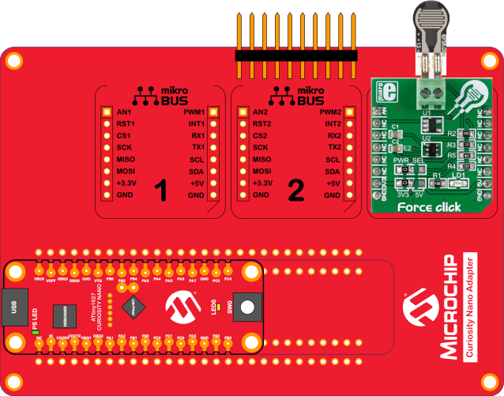
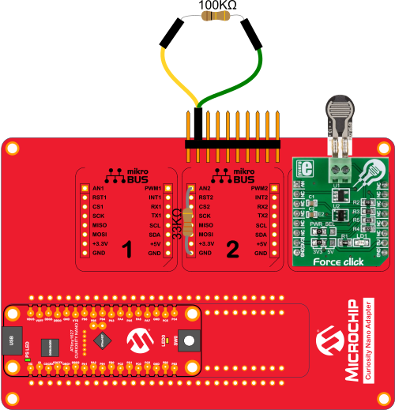

# Getting Started with tinyAVR 2 Family ADC Hands-On
This hands-on training goes through assignments that give a general introduction to the ADC module. Some of the
assignments are more specific to the 12-bit ADC and demonstrates the added features such as the PGA. Basic
theory related to each assignment is introduced at the beginning of each assignment, the functionality is then verified
through the MPLAB Data Visualizer. Every assignment is provided with a preconfigured code, where most code is
already in place and only essential modules for the specific assignment need to be configured. A solution for each assignment is also provided. All assignment except assignment 4 has a preconfigured workspace that can be loaded for the Data Visualizer. 

## Assignments
This hands-on training covers the following topics:

* Assignment 1: Single-Ended ADC
* Assignment 2: Understanding ADC modes
* Assignment 3: ADC Resolution from 12-bit to 17-bit
* Assignment 4: Read Temperature
* Assignment 5: Differential ADC
* Assignment 6: Using the PGA

## Related Documentation
* [ANxxxx - ATtiny1627 Getting Started with tinyAVR 2 Family ADC Hands-On](https://microchip.com/DS40002200)
* [ATtiny1627 device page](https://www.microchip.com/wwwproducts/en/ATTINY1627)

## Software Used
* [Atmel Studio](https://www.microchip.com/mplab/avr-support/atmel-studio-7) 7.0.2397 or later
* Atmel Studio ATtiny_DFP version 1.4.308 or later
* [MPLAB® Data Visualizer Stand-alone](https://gallery.microchip.com/packages/MPLAB-Data-Visualizer-Standalone(Windows)/) version 1.0.675 or later

## Hardware Used
* [Microchip ATtiny1627 Curiosity Nano Evaluation Kit](https://www.microchip.com/developmenttools/ProductDetails/DM080104) <!-- Fix this link-->
* [Microchip Curiosity Nano Base for Click boards™](https://www.microchip.com/DevelopmentTools/ProductDetails/AC164162)
* [Force Click board](https://www.mikroe.com/force-click)
* Micro-USB cable (Type-A/Micro-B)
* Two through-hole resistors, one 100 kΩ and one 33 kΩ

## Hardware Setup
The assignments have some differences in hardware setup and are explained in the [training manual](https://microchip.com/DS40002200). The different setups along with related figures are listed here:

### Configuration of Assignment 1,2,5
Requires: 
* ATtiny1627 Curiosity Nano Evaluation Kit 
* Force Click sensor

  

### Configuration of Assignment 3,4
Requires: 
* ATtiny1627 Curiosity Nano Evaluation Kit

### Configuration of Assignment 6 
Requires: 
* ATtiny1627 Curiosity Nano Evaluation Kit 
* Force Click sensor 
* Two through-hole resistors, one 100 kΩ and one 33 kΩ

  

## Running the Assignments in Studio
* Connect the ATtiny1627 Curiosity Nano to a computer using a USB cable
* Download the zip file or clone the example to get the source code
* Open the solution with Atmel Studio
* Add the necessary code for the assignment, see [training manual](https://microchip.com/DS40002200)
* Press Start without debugging or use CTRL+ALT+F5 hotkeys to run the application

## Conclusion
When you have finished this training you should have a basic understanding of the key features of the 12-bit ADC used in the ATtiny1627.

